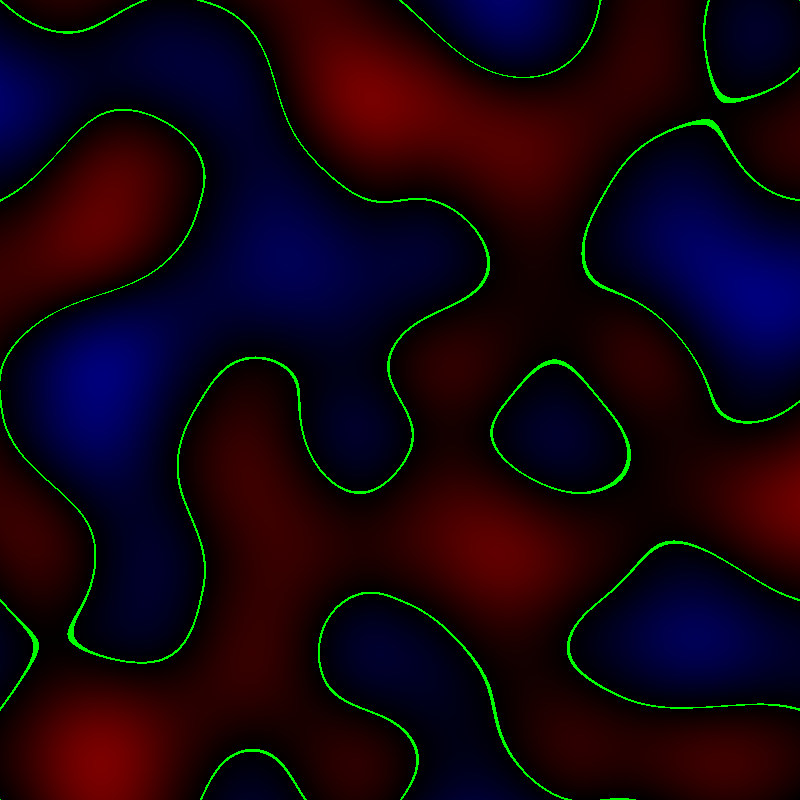
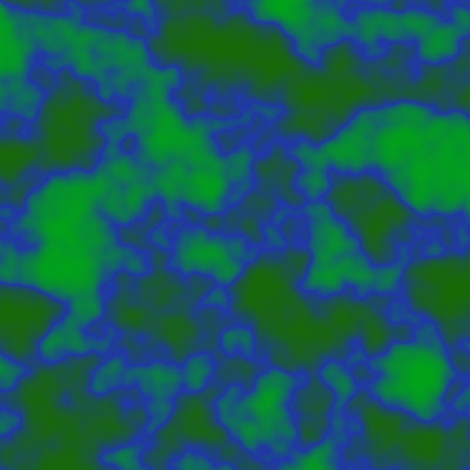

An implementation of noise similar to [Perlin Noise](https://en.wikipedia.org/wiki/Perlin_noise) with the main difference being a different hashing algorithm.

The purpose of this code is for me to learn and experiment with the algorithm and is not intended for use in other contexts.

Example output:

In this debug output, it is a single octave of noise where red is negative, green is (near) zero, and blue is positive.

This image is colors selected to be more appropriate for terrain and uses several octaves of noise. Near-zero regions are drawn in blue.
