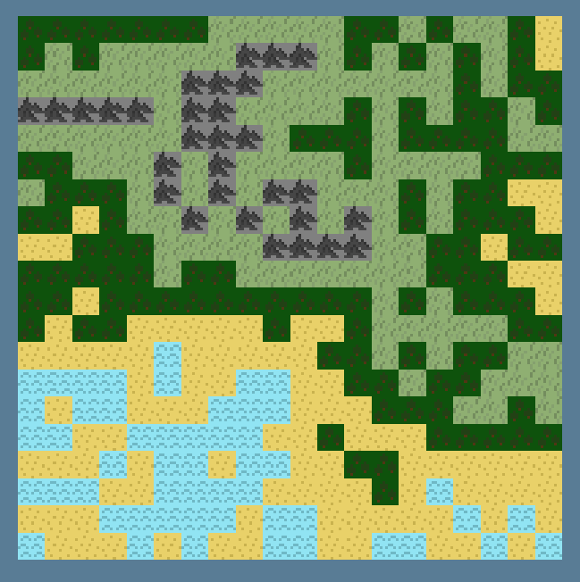

## Summary
An experiment/opportunity to learn about working with textures in wgpu, including modifying textures and adding new textures to a texture array at runtime. This uses an orthographic camera and allows panning and zooming on a 2D canvas.

Updating a texture from an image at runtime is pretty straightforward and is implemented in the `update` method of `Texture` in [src/texture.rs](src/texture.rs#L143)

Managing a texture array is more involved because of managing bind groups and other GPU state, and is implemented in `TextureArray` in [src/texture.rs](src/texture.rs#L170)

## Motivation
I wanted to experiment with ["wave function collapse" (a.k.a. "model synthesis")](https://en.wikipedia.org/wiki/Model_synthesis) in 2D for terrain/map generation. I implemented a basic 2D wave function collapse algorithm in [alg.rs](src/alg.rs). I wanted to be able to control the speed that tiles get placed, so there's a method `WFCState.step_algorithm()` that places a single tile, and this is wired up to advance the algorithm when pressing space. Here's example output from the algorithm:

