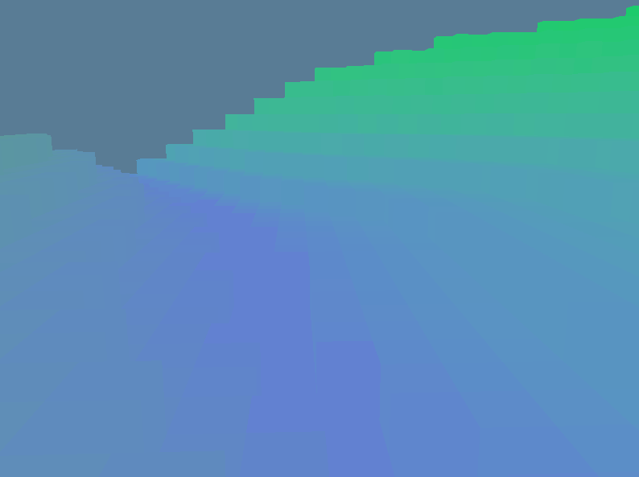

## Summary

This repo is a collection of experiments and personal projects that are independent but work with each other somewhat. Check out the subdirectories for the various projects:

## Rust Client
[rust_client](rust_client)

Contains a scene where you can move around and look at terrain made out of voxels, and a scene that demos ellipse-triangle collision detection and response in 3D.

The name is a bit aspirational -- it's an application that runs locally and doesn't have a backend or server component yet.

### Perlin Experiment

Playing around with a noise generation algorithm based on Perlin Noise.

### Wave Function Collapse Experiment

TODO